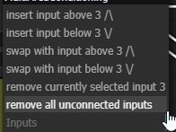
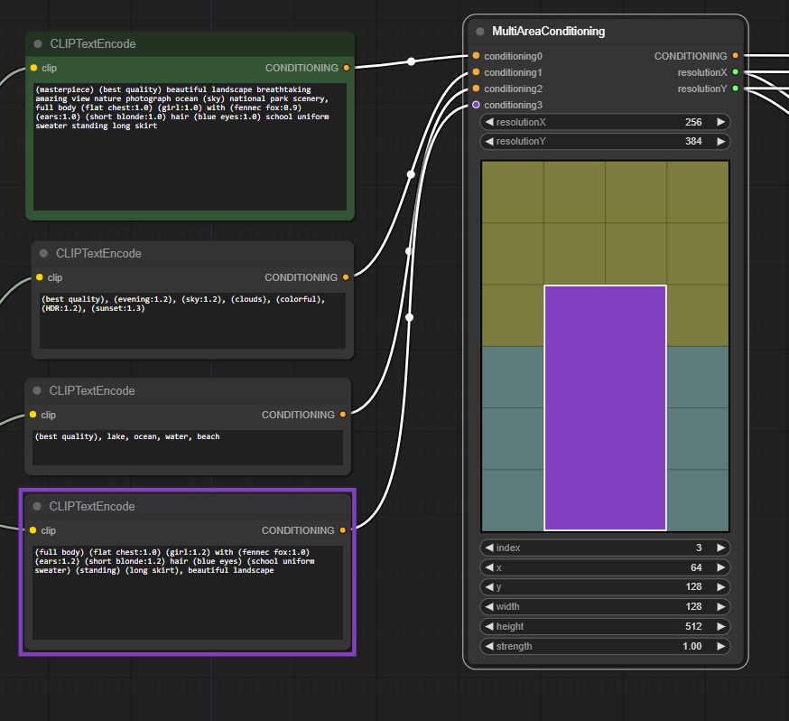

All credits to Daveman42 for this node; 
# Davemane42's [Custom Node](https://github.com/Davemane42/ComfyUI_Dave_CustomNode) for [ComfyUI](https://github.com/comfyanonymous/ComfyUI) 
the repository created by him was archived on April 2, 2024.

I experimented with various (newer, sometimes better) available alternatives but didn’t achieve the same results with older generations. Therefore, I adapted the custom node to prevent ComfyUI from freezing. Additionally, I removed the routines for automatic installation of the JavaScript files and instead registered the node in the ComfyUI Manager.
Thus, with the current version of ComfyUI, it is no longer necessary to perform an automatic installation in 'YourPath\ComfyUI_windows_portable\ComfyUI\web\extensions'.

https://github.com/comfyanonymous/ComfyUI/issues/5425#issuecomment-2448600231 
and
https://github.com/comfyanonymous/ComfyUI/issues/5425#issuecomment-2452987079

## Installation

### Option 1: Install via ComfyUI Manager
Open ComfyUI Manager and install the **Multi Area Conditioning** (author: **gdt**) custom node.

### Option 2: Install manually
cd ComfyUI/custom_nodes/ 
git clone https://github.com/GegenDenTag/ComfyUI-multi-area-condition-node 
Start Comfyui

___
# MultiAreaConditioning 2.4  

Let you visualize the ConditioningSetArea node for better control  

    
Right click menu to add/remove/swap layers:

    

Display what node is associated with current input selected 
(only works when the node itself is focused). 

___
### Example Workflow 

    
Workflows embedded in images

    
    
    
    

